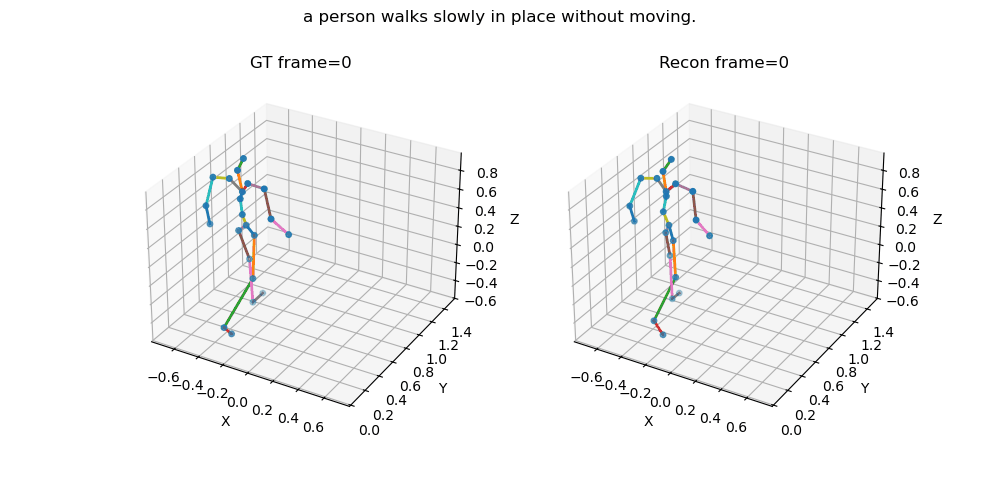
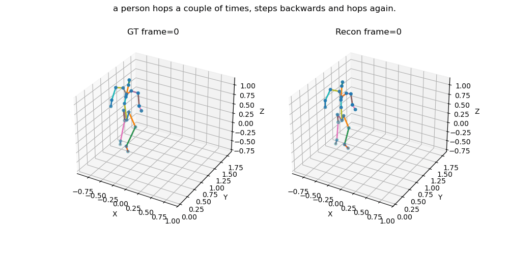
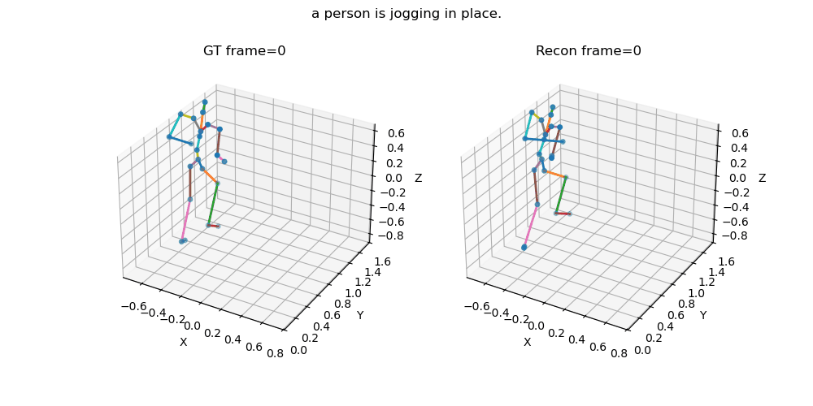
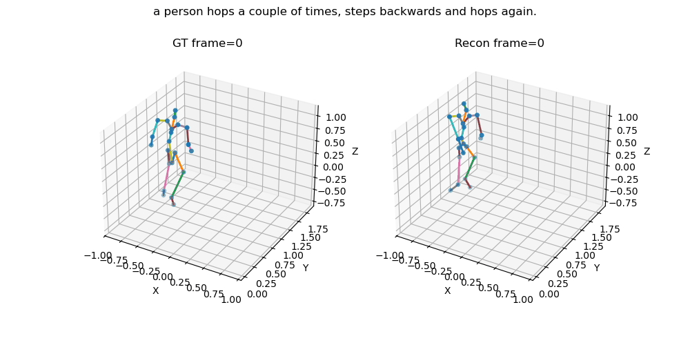

# Motion Editing

## Goal
The overarching goal of this project is **part-based motion editing**: changing only selected body regions of a motion sequence while preserving the rest of the motion. The longer-term aim is to support controlled edits from text and localized masks in latent space.

## Hypothesis
The core hypothesis is that a **part-based representation** can make motion editing more controllable than a single global latent. If motion is encoded with explicit body-part structure, then it should become easier to:

- isolate edits to specific parts,
- preserve unaffected motion content,
- and apply **part-based masking** in latent space for targeted generation.

In this view, part-aware latent structure and masked latent regeneration are the two main ingredients for controllable editing.
This codebase is heavily based on the implementation and data processing pipeline from the [EricGuo5513/text-to-motion](https://github.com/EricGuo5513/text-to-motion/tree/main) repository, with adaptations for part-based motion representation and latent editing experiments.

## Phases

### Phase 1 — Part-based VQ-VAE
The first phase focuses on learning a structured latent representation using a part-based VQ-VAE. The goal here is to test whether factorizing motion by body parts leads to useful latent organization, meaningful reconstructions, and interpolation behavior that is suitable for later editing.

### Phase 2 — Diffusion with masked latent editing
The second phase builds a diffusion pipeline on top of the learned latent space. The main idea is to corrupt or mask selected latent regions and regenerate them under conditioning, enabling localized motion edits while keeping the unmasked motion context intact.

## Current Repository Contents
At the current stage, the repository contains two main representation-learning components:

- **Pretrained VAE benchmark** — used as a baseline latent representation for comparison.
- **Part-based VQ-VAE** — the current experimental branch for structured, part-aware latent learning.

These two branches provide the benchmark-vs-structured setup needed to study whether part-based latent organization is beneficial for controllable editing.

## Outputs So Far

### Decoded results from Part-aware VQVAE vs Pretrained VAE from HumanML3D

**Validation Sample 1**
 

 

 

**Validation Sample 2**
 

 

 

### Basic Diffusion pipeline results
 

 

 

## Interpretation of Current Results

### Part-aware VQVAE
Current results show that the part-based VQ-VAE is already learning useful structure: validation reconstructions are meaningful, and interpolation samples suggest that the latent space captures non-trivial motion variation. At the same time, some outputs contain visible artifacts such as jitter or weak coordination across body regions, which suggests that the current representation is stronger at capturing local part behavior than full-body global context.

The current interpretation is that these artifacts are not only an optimization issue, but also an architectural one. With a relatively simple part-based encoder-decoder, each part can be modeled reasonably well in isolation, but the model has limited capacity to enforce smooth temporal consistency and coherent cross-part motion over longer ranges.

The planned improvement is to treat the current VQ-VAE as a useful first step rather than a final editing backbone. The next iteration should strengthen the part-based autoencoding pipeline with better multi-scale temporal context and stronger coordination across parts, while keeping the latent structure suitable for masking and controlled editing in the diffusion stage.

### Diffusion model
The Diffusion model consists of a transformer backend or DiT. The model has been trained on a very small nano set as an initial sanity check to validate the model code. The samples generated exhibit typical behaviour from an overfit pipeline, showing strong results for train set samples (Figure 1). More iterations are in progress to finalize the hyperparameters and train the DiT on the full dataset. Followed by this, we will proceed with one-step or few-step diffusion study.

## Immediate Next Steps
- Architectural improvement to be implemented to correct the jitters and other artifacts observed in the decoded samples.
- Building a one-step shortcut diffusion pipeline for motion generation and editing