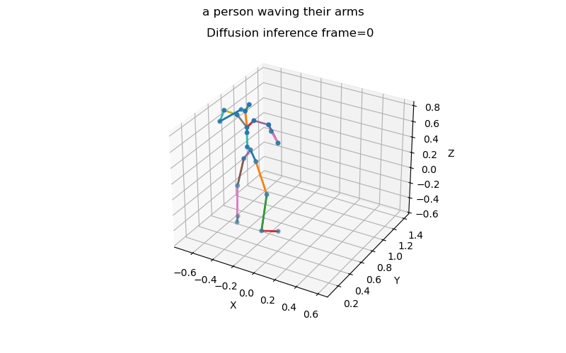
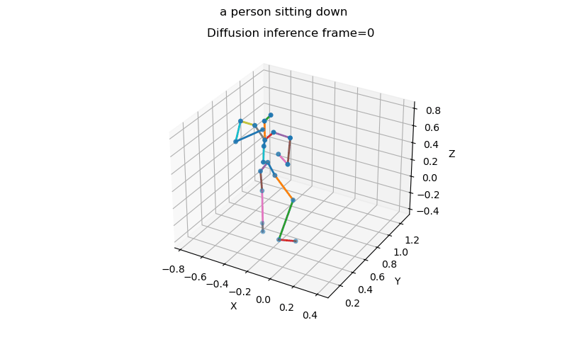
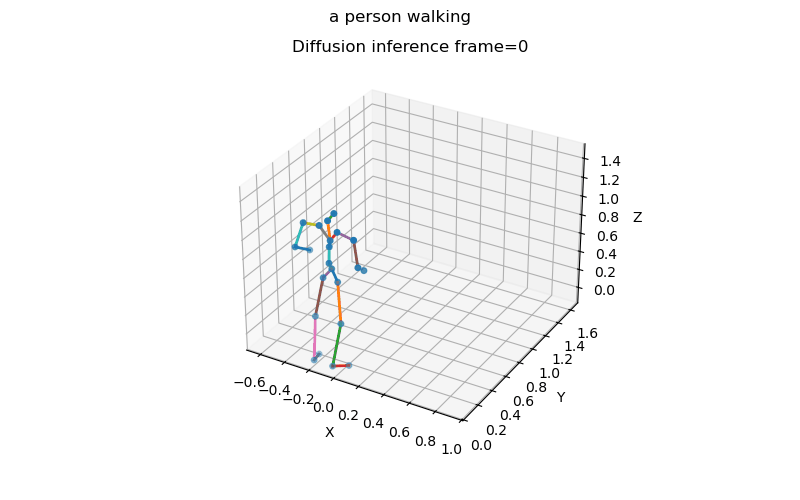

# Motion Synthesis 

## Goal
The current goal of this project is to develop a shortcut motion model that significantly speeds up inference for text-conditioned motion generation and editing, while maintaining the motion quality of a diffusion-based baseline. The repository now focuses on learning a fast, single-step (or few-step) generative model that approximates the behavior of a transformer-based stable diffusion backbone for human motion.

This codebase is heavily based on the implementation and data processing pipeline from the [EricGuo5513/text-to-motion](https://github.com/ChenFengYe/motion-latent-diffusion) repository, with adaptations for shortcut modeling and motion diffusion experiments.

## Hypothesis
The core hypothesis is that a shortcut generative model can learn to mimic the denoising behavior of a full diffusion process in motion latent space, reducing the number of sampling steps required for high-quality results. If the shortcut model is trained against a strong diffusion baseline, then it should become easier to:
generate plausible motions in a single (or very few) steps, retain semantic alignment with text prompts, and support motion editing by operating in the same latent space as the diffusion backbone.

In this view, a well-trained shortcut model and a stable diffusion reference model are the two main ingredients for fast, controllable motion generation.

## Phases

### Phase 1 — Baseline diffusion
The current phase establishes and refines a baseline diffusion model for text-to-motion generation.

### Phase 2 — Shortcut diffusion model
The second phase focuses on using the diffusion model to supervise a shortcut model that approximates its outputs. The diffusion backbone is trained on HumanML3D, and the shortcut model is trained to predict diffusion-like denoised latents directly, under text conditioning. The emphasis is on:

- stabilizing the transformer-based stable diffusion baseline,
- experimenting with geometric regularizers to improve motion plausibility,
- and training a shortcut model that closely matches baseline outputs while requiring far fewer inference steps.

## Current Repository Contents
At the current stage, the repository contains two main modeling components:

- Stable diffusion baseline — a transformer-based diffusion model trained on HumanML3D, used as the reference 
for motion quality and semantics.

- Shortcut motion model (in progress) — a fast generative model being trained to approximate the denoising 
behavior of the diffusion baseline for both motion generation and potential editing.

These two components provide the baseline-vs-shortcut setup needed to study whether shortcut modeling can reduce 
inference cost while preserving motion quality.

## Outputs So Far

### Basic Diffusion pipeline inference results
 

 
 

 
 

 

## Interpretation of Current Results

### Diffusion model
The diffusion model has been trained on the HumanML3D dataset with a transformer backend. It currently serves as 
the primary baseline, and ongoing experiments add regularizers aimed at improving geometric plausibility (e.g., 
reducing jitter, enforcing smoother trajectories and more realistic contact behavior). These baseline results 
show usable motions, which now act as targets for the shortcut model

## Immediate Next Steps
- Refine geometric regularization and architectural choices in the diffusion baseline to reduce jitter and 
artifacts in generated motions.
- Train and evaluate a one-step (or few-step) shortcut motion model that approximates the baseline diffusion 
outputs, with an emphasis on faster inference for both generation and editing.